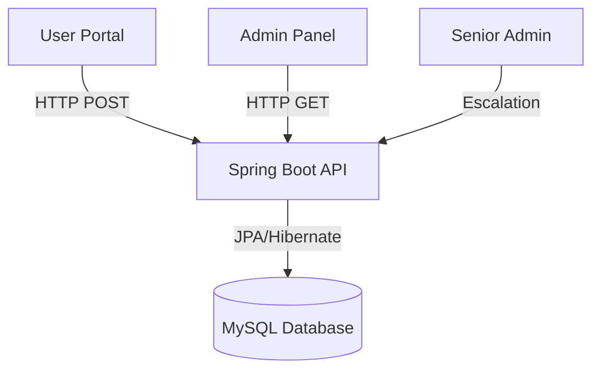

# 🛡️ ResolveIT | Grievance Portal


A powerful, full-stack **Grievance Management System** designed for educational institutions and corporate offices. This platform streamlines user complaints, automates admin assignments, and provides an audited escalation workflow for senior authorities.

---

## 🎯 Key Capabilities & Milestones

| Milestone | Status | Description |
| :--- | :---: | :--- |
| **M1: Full-Stack Core** | ✅ | React frontend integrated with Spring Boot REST API and MySQL. |
| **M2: UI/UX Excellence** | ✅ | Professional, desktop-friendly blue theme with smooth transitions. |
| **M3: Profile & Tracking** | ✅ | Dynamic user dashboards showing status updates in real-time. |
| **M4: Escalation Engine** | ✅ | Formal forwarding workflow to Warden/Dean/Principal with notifications. |
| **M5: Analytics & Export** | ✅ | Visual bar charts for trends and functional CSV report generation. |

---

## 🧠 Architectural Overview



---

## 🚀 Stunning Features

### 👤 For Users
- **Secure Authentication:** Persistent login sessions (even after refresh!).
- **Rich Submissions:** Categorized grievances (Public/Anonymous) with media attachments.
- **My Complaints:** Track your issue status from "NEW" to "RESOLVED" on a live timeline.

### 🛡️ For Admins
- **Management Panel:** Centralized dashboard to view all institutional grievances.
- **Staff Assignment:** Delegate issues to Technical, Maintenance, or Admin teams.
- **Escalation Logic:** Forward unresolved issues to Higher Authorities with one click.
- **Data Export:** Download audited reports in **CSV format** for institutional records.

---

## 🛠️ Project Structure

```text
📁 ResolveIT_FullStack/
  ├── 📂 backend/       # Spring Boot Application (Java)
  │   ├── 👤 Auth         # Registration & Security
  │   ├── 📝 Complaints   # Core Grievance Logic
  │   └── ⚙️ Config       # Database & CORS (Cross-Origin)
  ├── 📂 frontend/      # React.js Application (Vite/Node)
  │   ├── 🎨 Components   # Reusable UI Elements
  │   ├── 📁 Assets       # Hero Images & Branding
  │   └── 🌐 API          # Database Connection logic
  └── 📄 README.md      # Documentation
```

---

## ⚙️ How to Launch Locally

### 1️⃣ Database Setup
- Create a MySQL database named `complaint_db`.
- Run your SQL script or use Hibernate (auto-create).

### 2️⃣ Backend (IntelliJ)
- Open the `backend/` folder in **IntelliJ IDEA**.
- Update `application.properties` with your MySQL password.
- Run `ComplaintPortalApplication.java`.

### 3️⃣ Frontend (VS Code)
- Open the `frontend/` folder in **VS Code**.
- Copy `frontend/.env.example` to `frontend/.env` and set `VITE_API_URL` if needed.
- Run `npm install` and then `npm run dev`.
- Visit `http://localhost:5173`.

---

## 🌐 Deploy Online

### Frontend (Vercel)
1. Import [github.com/SaitejaAerupula/ResolveIt_IF_SP](https://github.com/SaitejaAerupula/ResolveIt_IF_SP) on [Vercel](https://vercel.com).
2. Set environment variable: `VITE_API_URL` = your backend URL (e.g. `https://resolveit-backend.onrender.com`).
3. Deploy — Vercel uses the included `vercel.json`.

### Backend (Render)
1. Create a [Render](https://render.com) account and connect your GitHub repo.
2. Use the included `render.yaml` or create a **Web Service** from `backend/Dockerfile`.
3. Add a MySQL database (Render, PlanetScale, or Railway) and set:
   - `SPRING_DATASOURCE_URL` — JDBC URL (e.g. `jdbc:mysql://host:3306/complaint_db`)
   - `SPRING_DATASOURCE_USERNAME`
   - `SPRING_DATASOURCE_PASSWORD`
4. Deploy the backend, then point the frontend `VITE_API_URL` to the live backend URL.

---

## 👨‍💻 Developed By
**Saiteja Aerupula**  
*Full Stack Developer | Grievance Management Specialist*

---
© 2026 ResolveIT Team. All Rights Reserved.
